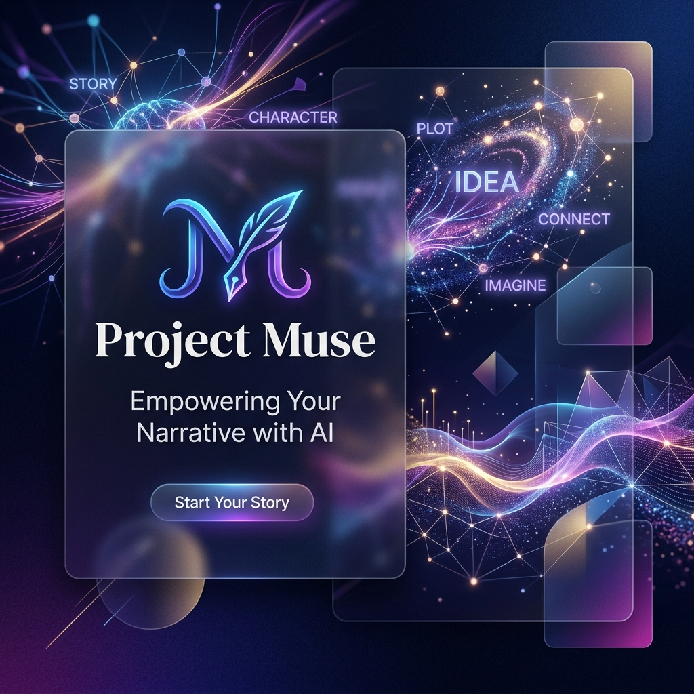

# Project Muse 🖋️✨



> **The Architectural Hub for Creative Writers.**  
> **L'Architetto Narrativo per la Scrittura Creativa.**

---

## 🇮🇹 Introduzione
**Project Muse** è un'applicazione web modulare progettata per scrittori che desiderano unire l'arte della narrazione alla potenza dell'Intelligenza Artificiale. Non è un semplice editor di testo, ma un ecosistema completo per pianificare, scrivere e analizzare le tue storie.

## 🇬🇧 Introduction
**Project Muse** is a modular web application designed for writers who want to blend the art of storytelling with the power of Artificial Intelligence. It’s not just a text editor, but a complete ecosystem for planning, writing, and analyzing your stories.

---

## ✨ Caratteristiche / Key Features

### 📖 Narrativa / Narrative 
- **Editor Tiptap Avanzato**: Scrittura immersiva con supporto per scene e capitoli.
- **Integrazione Personaggi**: Richiama i dettagli dei tuoi personaggi direttamente nell'editor.
- **Reordering Persistente**: Organizza la sequenza dei capitoli e delle scene con trascinamento fluido salvato sul cloud.
- **Advanced Tiptap Editor**: Immersive writing with support for scenes and chapters.
- **Persistent Reordering**: Organize your narrative sequence with fluid drag-and-drop saved to the cloud.

### 👥 Personaggi / Characters
- **Profili Dettagliati**: Gestisci motivazioni, tratti e archi narrativi dei personaggi.
- **Ritratti Cinematografici**: Visualizzazione dei protagonisti in grande formato con **riposizionamento interattivo** (X/Y) per centrare perfettamente il soggetto.
- **Intervista AI**: Chiacchiera direttamente con i tuoi personaggi attraverso l'AI per scoprirne la voce.
- **Detailed Profiles**: Manage motivations, traits, and narrative arcs.
- **Cinematic Portraits**: Large-format visuals with **interactive repositioning** to center your subjects perfectly.

### 🌍 World Building
- **Categorizzazione Intelligente**: Organizza il tuo mondo in **Luoghi** (primari/secondari) e **Oggetti** (leggendari/comuni).
- **Titoli Editabili**: Gestione dinamica degli elementi con salvataggio istantaneo.
- **Smart Categorization**: Organize your lore into **Locations** and **Objects** (Items/Artifacts).
- **Dynamic Management**: Instant saving and editable titles for all world elements.

### 📝 Note / Notes
- **Drag & Drop Workflow**: Un sistema di note a griglia completamente riordinabile per organizzare idee, riferimenti e immagini.
- **Integrazione Cloud**: Sincronizzazione in tempo reale delle tue riflessioni sparse.
- **Intuitive Grid**: Fully reorderable note system to organize ideas, references, and images.

### 🧠 AI Sidekick (Powered by Groq & Gemini Flash)
- **Multi-Provider**: Scegli tra la velocità di **Groq (Llama 3.3)** e l'immensa memoria di **Gemini 1.5 Flash**.
- **Revisione Intelligente**: Proposte di modifica chirurgiche per migliorare ritmo e stile.
- **Context Awareness**: Grazie a Gemini, Muse può analizzare interi romanzi senza perdere il filo.
- **Transformer & Lessico**: Riscrivi scene in diversi stili e trova metafore originali.

---

## 🛠️ Tech Stack

- **Frontend**: [React 19](https://react.dev/), [Vite](https://vitejs.dev/), [TypeScript](https://www.typescriptlang.org/)
- **Styling**: [Tailwind CSS](https://tailwindcss.com/), [Framer Motion](https://www.framer.com/motion/)
- **Backend / DB**: [Supabase](https://supabase.com/)
- **AI Engines**: [Groq SDK](https://groq.com/), [Google Gemini Flash SDK](https://ai.google.dev/)
- **Editor**: [Tiptap](https://tiptap.dev/)
- **Drag & Drop**: [@hello-pangea/dnd](https://github.com/hello-pangea/dnd)
- **State Management**: [Zustand](https://github.com/pmndrs/zustand)

---

## 🚀 Setup & Installazione / Setup & Installation

### Prerequisiti / Prerequisites
- Node.js (v18+)
- Account Supabase & API Key (Groq e/o Gemini)

### Configurazione Database (SQL)
Per abilitare le nuove funzioni di reordering e posizionamento, esegui questo script nell'editor SQL di Supabase:

```sql
-- Reordering per Note e Scene
ALTER TABLE notes ADD COLUMN IF NOT EXISTS order_index INTEGER DEFAULT 0;
ALTER TABLE chapters ADD COLUMN IF NOT EXISTS order_index INTEGER DEFAULT 0;
ALTER TABLE scenes ADD COLUMN IF NOT EXISTS order_index INTEGER DEFAULT 0;

-- World Building Categorie
ALTER TABLE settings ADD COLUMN IF NOT EXISTS category TEXT DEFAULT 'location';

-- Posizionamento Immagini Personaggi
ALTER TABLE characters 
ADD COLUMN IF NOT EXISTS avatar_pos_x INTEGER DEFAULT 50,
ADD COLUMN IF NOT EXISTS avatar_pos_y INTEGER DEFAULT 50;
```

### Installazione / Getting Started

1. **Clona il repository**: `git clone https://github.com/your-username/Muse.git`
2. **Installa le dipendenze**: `npm install`
3. **Configura il file `.env`** con le tue chiavi Supabase e Groq.
4. **Avvia**: `npm run dev`

---

## 📄 Licenza / License
Distribuito sotto licenza MIT. Vedi `LICENSE` per maggiori informazioni.

---

<p align="center">
  Creato con ❤️ per gli scrittori di tutto il mondo. <br/>
  Made with ❤️ for writers everywhere.
</p>
